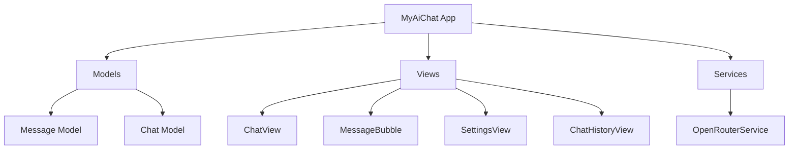

# Building an AI Chat App with SwiftUI
## A 3-Day Coding Camp Guide

This document outlines the step-by-step process of building a simple but functional AI chat application using SwiftUI and the OpenRouter API. The app will be built over three days, with each day focusing on specific components and concepts.

## Prerequisites
- Basic understanding of Swift programming language
- Xcode installed on your Mac
- An OpenRouter API key (will be provided)

## Project Overview



## Day 1: Foundation and Basic Chat Interface

### Morning Session: Project Setup and Models
1. Create a new SwiftUI project
   - Create a new Xcode project
   - Choose "App" template with SwiftUI interface
   - Name it "MyAiChat"

2. Create Basic Models (30 minutes)
   ```swift
   // Message.swift
   struct Message: Identifiable, Codable {
       let id = UUID()
       let content: String
       let isFromUser: Bool
       let timestamp: Date
   }

   // Chat.swift
   struct Chat: Identifiable, Codable {
       let id = UUID()
       let title: String
       var messages: [Message]
       let createdAt: Date
   }
   ```

### Afternoon Session: Building the Chat Interface
1. Create MessageBubble View (45 minutes)
   - Design message bubbles for user and AI responses
   - Implement different styles for each sender
   - Add timestamp display

2. Create Basic ChatView (1 hour)
   - Implement the message list using ScrollView
   - Add text input field and send button
   - Create basic UI layout

## Day 2: API Integration and Core Functionality

### Morning Session: OpenRouter Integration
1. Create OpenRouter Service (1 hour)
   - Implement API communication
   - Handle API key storage
   - Create response models

2. Connect Service to ChatView (1 hour)
   - Implement message sending functionality
   - Handle API responses
   - Add loading states
   - Implement error handling

### Afternoon Session: Settings and Persistence
1. Create SettingsView (45 minutes)
   - Add API key configuration
   - Implement secure storage
   - Add basic app information

2. Implement Basic Data Persistence (1 hour)
   - Set up UserDefaults for API key
   - Test API integration
   - Debug and refine

## Day 3: Polish and Additional Features

### Morning Session: Chat History
1. Implement ChatHistoryView (1 hour)
   - Create chat history interface
   - Implement chat storage
   - Add delete functionality

2. Navigation and Tab Bar (45 minutes)
   - Set up TabView in ContentView
   - Implement navigation between views
   - Add appropriate icons and labels

### Afternoon Session: Final Polish
1. UI Improvements (1 hour)
   - Add animations
   - Improve error messages
   - Enhance visual feedback

2. Testing and Debugging (1 hour)
   - Test all features
   - Fix any remaining bugs
   - Optimize performance

## Key Learning Outcomes
- SwiftUI fundamentals and UI construction
- Working with REST APIs in Swift
- Data persistence using UserDefaults
- Asynchronous programming with async/await
- State management in SwiftUI
- Error handling and user feedback

## Tips for Success
- Test frequently as you build
- Use print statements for debugging
- Keep the code organized and well-commented
- Follow SwiftUI best practices
- Ask questions when stuck

## Common Pitfalls to Avoid
- Forgetting to handle loading states
- Not providing user feedback for errors
- Ignoring memory management
- Skipping error handling
- Not testing edge cases

## Resources
- [SwiftUI Documentation](https://developer.apple.com/documentation/swiftui)
- [OpenRouter API Documentation](https://openrouter.ai/docs)
- [Swift Async/Await Guide](https://docs.swift.org/swift-book/LanguageGuide/Concurrency.html)