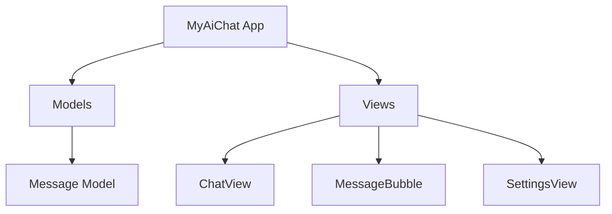

# Building an AI Chat App with SwiftUI
## A 2-Day Coding Camp Guide

This document outlines the step-by-step process of building a simple but functional AI chat application using SwiftUI and the OpenRouter API. The app will be built over two days, with each day focusing on specific components and concepts.

## Prerequisites
- Basic understanding of Swift programming language
- Xcode installed on your Mac
- OpenRouter API key (will be provided)
- OpenRouterService.swift file (will be provided)

## Project Overview



## Day 1: Foundation and User Interface

### Morning Session: Project Setup and Models
1. Create a new SwiftUI project
   - Create a new Xcode project
   - Choose "App" template with SwiftUI interface
   - Name it "MyAiChat"

2. Create Message Model
   ```swift
   // Message.swift
   import Foundation

   /// This view represents a single chat message.
   struct Message: Identifiable, Codable, Equatable {
       /// Unique identifier for the message.
       let id = UUID()
       /// The text content of the message.
       let content: String
       /// Indicates if the message was sent by the user.
       let isFromUser: Bool
       /// The date and time when the message was created.
       let timestamp: Date
       
       /// Initializes a new Message with the given content and sender flag.
       /// - Parameters:
       ///   - content: The text of the message.
       ///   - isFromUser: True if the message is from the user, false otherwise.
       init(content: String, isFromUser: Bool) {
           self.content = content
           self.isFromUser = isFromUser
           self.timestamp = Date()
       }
   }
   ```

### Afternoon Session: Building the Chat Interface
1. Create MessageBubble View
   ```swift
   import SwiftUI

   /// A view component that displays a single chat message as a bubble
   /// with different styling based on whether it's from the user or AI
   struct MessageBubble: View {
       /// The message data to be displayed in the bubble
       let message: Message
       
       var body: some View {
           HStack {
               if message.isFromUser {
                   // User messages are aligned to the right with blue background
                   Spacer()
                   messageContent
                       .background(Color.blue, in: RoundedRectangle(cornerRadius: 15))
                       .shadow(radius: 1)
                       .foregroundColor(.white)
               } else {
                   VStack {
                       HStack {
                           Image(systemName: "person.circle.fill")
                               .font(.largeTitle)
                               .foregroundStyle(.blue)
                               .padding(.leading, 6)
                           Spacer()
                       }
                       messageContent
                           // set to primary color for better contrast
                           .foregroundColor(.primary)
                   }
               }
           }
       }
       
       /// The content view for the message bubble
       /// Contains the message text and timestamp
       private var messageContent: some View {
           VStack(alignment: .leading, spacing: 4) {
               // Message content text
               Text(message.content)
                   .padding(.horizontal, 12)
                   .padding(.vertical, 8)
               // Timestamp displayed below the message
               Text(message.timestamp, style: .time)
                   .font(.caption)
                   .foregroundColor(.secondary)
                   .padding(.horizontal, 12)
                   .padding(.bottom, 6)
           }
       }
   }
   ```

2. Create Basic ChatView
   ```swift
   import SwiftUI

   // Basic chat interface without API integration
   struct ChatView: View {
       // Collection of messages in the current chat
       @State private var messages: [Message] = []
       // Text content of the input field
       @State private var inputText = ""
       // Controls keyboard focus state
       @FocusState private var isFocused: Bool
       
       var body: some View {
           VStack(alignment: .leading) {
               Text("SwiftChat")
                   .font(.largeTitle.bold())
                   .padding()
               
               ScrollViewReader { proxy in
                   ScrollView {
                       LazyVStack(spacing: 8) {
                           ForEach(messages) { message in
                               MessageBubble(message: message)
                                   .id(message.id)
                           }
                       }
                       .padding()
                   }
                   .onChange(of: messages) { _, newMessages in
                       if let lastMessage = newMessages.last {
                           withAnimation {
                               proxy.scrollTo(lastMessage.id, anchor: .bottom)
                           }
                       }
                   }
                   .onTapGesture {
                       isFocused = false
                   }
               }
               
               HStack {
                   TextField("Ask anything...", text: $inputText)
                       .textFieldStyle(RoundedBorderTextFieldStyle())
                       .focused($isFocused)
                   
                   Button(action: sendMessage) {
                       Image(systemName: "paperplane.circle.fill")
                           .foregroundColor(inputText.isEmpty ? .gray : .blue)
                           .font(.title)
                   }
                   .disabled(inputText.isEmpty)
               }
               .padding()
           }
       }
       
       private func sendMessage() {
           guard !inputText.isEmpty else { return }
           
           let message = Message(content: inputText, isFromUser: true)
           messages.append(message)
           inputText = ""
           
           // Simulate AI response (will be replaced with actual API call)
           DispatchQueue.main.asyncAfter(deadline: .now() + 1) {
               let response = Message(content: "This is a test response", isFromUser: false)
               messages.append(response)
           }
       }
   }
   ```

## Day 2: API Integration and Settings

### Morning Session: API Integration and Testing
1. Add OpenRouterService.swift to the project

2. Update ChatView with API Integration
   ```swift
   import SwiftUI

   // A view that displays a chat interface for interacting with an AI assistant.
   // This view handles:
   // - Message display in a scrollable view
   // - Text input and sending
   // - Keyboard management with gesture-based dismissal
   // - Auto-scrolling to new messages

   // Background gradient for the chat interface
   let homeBackground: [Color] = [
       .backgroundTop,
       .backgroundBottom
   ]

   struct ChatView: View {
       // MARK: - Properties
       
       /// Service for making API calls to OpenRouter
       /// Manages API communication and maintains state across view updates
       @StateObject private var apiService = OpenRouterService()
       
       /// Collection of messages in the current chat
       /// Stores both user and AI messages in chronological order
       @State private var messages: [Message] = []
       
       /// Text content of the input field
       @State private var inputText = ""
       
       /// Controls keyboard focus state
       @FocusState private var isFocused: Bool
       
       /// Flag indicating if a message is currently being processed
       @State private var isLoading = false
       
       /// API key stored in app storage for persistence
       @AppStorage("openrouter_api_key") private var apiKey: String = ""
       
       var body: some View {
           VStack(alignment: .leading) {
               Text("SwiftChat")
                   .font(.largeTitle.bold())
                   .padding()
               
               ScrollViewReader { proxy in
                   ScrollView {
                       LazyVStack(spacing: 8) {
                           ForEach(messages) { message in
                               MessageBubble(message: message)
                                   .id(message.id)
                           }
                       }
                       .padding()
                   }
                   .onChange(of: messages) { _, newMessages in
                       if let lastMessage = newMessages.last {
                           withAnimation {
                               proxy.scrollTo(lastMessage.id, anchor: .bottom)
                           }
                       }
                   }
                   .onTapGesture {
                       isFocused = false
                   }
               }
               
               HStack {
                   TextField("Ask anything...", text: $inputText)
                       .textFieldStyle(RoundedBorderTextFieldStyle())
                       .focused($isFocused)
                   
                   Button(action: sendMessage) {
                       Image(systemName: "paperplane.circle.fill")
                           .foregroundColor(inputText.isEmpty || isLoading ? .gray : .blue)
                           .font(.title)
                   }
                   .disabled(inputText.isEmpty || isLoading)
               }
               .padding()
           }
           .onAppear {
               apiService.setAPIKey(apiKey)
           }
           .onChange(of: apiKey) { _, newKey in
               apiService.setAPIKey(newKey)
           }
           .background(Gradient(colors: homeBackground))
       }
       
       /// Sends the user's message to the AI service and handles the response.
       /// This method:
       /// 1. Creates and adds the user's message
       /// 2. Clears the input field
       /// 3. Makes an async API call to get AI response
       /// 4. Handles successful response by adding AI message
       /// 5. Handles errors by displaying error message
       private func sendMessage() {
           if inputText.isEmpty { return }
           
           let userMessage = Message(content: inputText, isFromUser: true)
           messages.append(userMessage)
           
           let messageText = inputText
           inputText = ""
           isLoading = true
           
           Task {
               do {
                   let response = try await apiService.sendMessage(messageText)
                   let aiMessage = Message(content: response, isFromUser: false)
                   
                   await MainActor.run {
                       messages.append(aiMessage)
                       isLoading = false
                   }
               } catch {
                   await MainActor.run {
                       let errorMessage = Message(
                           content: "Error: \(error.localizedDescription)", 
                           isFromUser: false
                       )
                       messages.append(errorMessage)
                       isLoading = false
                   }
               }
           }
       }
   }
   ```

3. Create SettingsView
   ```swift
   import SwiftUI

   struct SettingsView: View {
       @AppStorage("openrouter_api_key") private var apiKey: String = ""
       @State private var tempApiKey: String = ""
       @State private var showingSaveAlert = false
       
       var body: some View {
           NavigationView {
               Form {
                   Section(header: Text("API Configuration")) {
                       SecureField("OpenRouter API Key", text: $tempApiKey)
                           .onAppear { tempApiKey = apiKey }
                       
                       Button("Save API Key") {
                           apiKey = tempApiKey
                           showingSaveAlert = true
                       }
                       .disabled(tempApiKey.isEmpty)
                   }
                   
                   Section(header: Text("About")) {
                       HStack {
                           Text("Version")
                           Spacer()
                           Text("1.0.0")
                       }
                   }
               }
               .navigationTitle("Settings")
               .alert("API Key Saved", isPresented: $showingSaveAlert) {
                   Button("OK") { }
               }
           }
       }
   }
   ```

## Day 3: Polish and Final Testing

### Morning Session: Final Testing and Debugging
1. Test all features thoroughly
    - Send and receive messages
    - Save and load API key
    - Handle errors appropriately
    - Check UI responsiveness

2. Update Main App Structure
   ```swift
   import SwiftUI

   struct ContentView: View {
       var body: some View {
           TabView {
               ChatView()
                   .tabItem {
                       Image(systemName: "message")
                       Text("Chat")
                   }
               
               SettingsView()
                   .tabItem {
                       Image(systemName: "gear")
                       Text("Settings")
                   }
           }
       }
   }
   ```

### Afternoon Session: Polish and Optimization
1. Polish and debug:
   - Ensure smooth animations
   - Test error cases
   - Verify data persistence
   - Check network handling

## Key Learning Outcomes
- SwiftUI fundamentals and UI construction
- Working with REST APIs in Swift
- Data persistence using UserDefaults
- Asynchronous programming with async/await
- State management in SwiftUI
- Error handling and user feedback

## Tips for Success
- Test frequently as you build
- Use print statements for debugging
- Keep the code organized and well-commented
- Follow SwiftUI best practices
- Ask questions when stuck

## Resources
- [SwiftUI Documentation](https://developer.apple.com/documentation/swiftui)
- [OpenRouter API Documentation](https://openrouter.ai/docs)
- [Swift Async/Await Guide](https://docs.swift.org/swift-book/LanguageGuide/Concurrency.html)

## Glossary of Terms and Concepts

### Swift and SwiftUI Basics
- **SwiftUI**: Apple's modern declarative framework for building user interfaces across all Apple platforms.
- **View**: A basic building block of user interfaces in SwiftUI, representing what users see on screen.
- **State**: A property wrapper (`@State`) that allows SwiftUI to automatically update the UI when the value changes.
- **Binding**: A connection between a property and a view that displays and changes it, marked with `$` prefix.
- **ObservableObject**: A type of object that automatically notifies SwiftUI when its data changes.
- **@StateObject**: A property wrapper that creates and manages an observable object associated with a view.
- **@ObservedObject**: A property wrapper that subscribes to an observable object and updates a view when it changes.
- **@AppStorage**: A property wrapper that reads and writes values from UserDefaults.

### Layout and UI Components
- **VStack**: A view that arranges its children in a vertical line.
- **HStack**: A view that arranges its children in a horizontal line.
- **ScrollView**: A view that enables scrolling of its content.
- **LazyVStack**: A vertical stack that loads its views on-demand as they become visible.
- **NavigationView**: A view that enables navigation between views.
- **TabView**: A view that switches between multiple child views using interactive tabs.
- **Form**: A container that presents data entry components in a customizable scrolling list.
- **List**: A container that presents rows of data arranged in a single column.

### Data and Networking
- **JSON**: JavaScript Object Notation, a format for storing and transporting data.
- **API**: Application Programming Interface, a set of rules for how software components should interact.
- **REST API**: A type of API that uses HTTP requests to access and manipulate data.
- **API Key**: A unique identifier used to authenticate and authorize API requests.
- **HTTP Methods**: Standard methods for interacting with web servers (GET, POST, etc.).
- **URLSession**: Apple's API for downloading and uploading data from the internet.
- **Codable**: A protocol that enables converting Swift types to and from JSON.
- **UserDefaults**: A system for storing small amounts of persistent data.

### Swift Programming Concepts
- **struct**: A value type that groups related properties and methods.
- **class**: A reference type that can be inherited and shared.
- **protocol**: A blueprint of methods, properties, and requirements.
- **property wrapper**: A type that adds behavior to a property.
- **async/await**: Modern Swift syntax for handling asynchronous code.
- **Task**: A unit of async work that can be started, cancelled, and monitored.
- **try/catch**: Swift's error handling mechanism.
- **guard**: A conditional statement that must end in a transfer of control if the condition is not met.

### Development Tools
- **Xcode**: Apple's integrated development environment (IDE).
- **Simulator**: A tool that simulates iOS devices on your Mac.
- **Preview**: SwiftUI's live preview feature in Xcode.
- **Debug Console**: Where print statements and error messages appear.
- **Breakpoint**: A debugging tool that pauses code execution at a specific point.