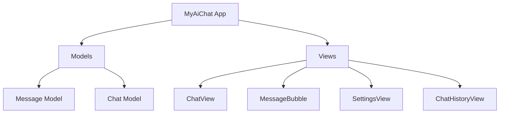

# Building an AI Chat App with SwiftUI
## A 3-Day Coding Camp Guide

This document outlines the step-by-step process of building a simple but functional AI chat application using SwiftUI and the OpenRouter API. The app will be built over three days, with each day focusing on specific components and concepts.

## Prerequisites
- Basic understanding of Swift programming language
- Xcode installed on your Mac
- OpenRouter API Key (will be provided)
- OpenRouterService.swift file (will be provided)

## Project Overview



## Day 1: Foundation and Basic Chat Interface

### Morning Session: Project Setup and Models
1. Create a new SwiftUI project
   - Create a new Xcode project
   - Choose "App" template with SwiftUI interface
   - Name it "MyAiChat"

2. Create Basic Models
   ```swift
   // Message.swift
   import Foundation

   struct Message: Identifiable, Codable {
       let id = UUID()
       let content: String
       let isFromUser: Bool
       let timestamp: Date
       
       init(content: String, isFromUser: Bool) {
           self.content = content
           self.isFromUser = isFromUser
           self.timestamp = Date()
       }
   }

   // Chat.swift
   import Foundation

   struct Chat: Identifiable, Codable {
       let id = UUID()
       let title: String
       var messages: [Message]
       let createdAt: Date
       
       init(title: String) {
           self.title = title
           self.messages = []
           self.createdAt = Date()
       }
   }
   ```

### Afternoon Session: Building the Chat Interface
1. Create MessageBubble View
   ```swift
   import SwiftUI

   struct MessageBubble: View {
       let message: Message
       
       var body: some View {
           HStack {
               if message.isFromUser {
                   Spacer()
                   messageContent
                       .background(Color.blue, in: RoundedRectangle(cornerRadius: 15))
                       .foregroundColor(.white)
               } else {
                   messageContent
                       .background(Color.gray, in: RoundedRectangle(cornerRadius: 15))
                       .foregroundColor(.white)
                   Spacer()
               }
           }
       }
       
       private var messageContent: some View {
           VStack(alignment: .leading, spacing: 4) {
               Text(message.content)
                   .padding(.horizontal, 12)
                   .padding(.vertical, 8)
               Text(message.timestamp, style: .time)
                   .font(.caption)
                   .padding(.horizontal, 12)
                   .padding(.bottom, 6)
           }
           .frame(maxWidth: 280, alignment: .leading)
       }
   }
   ```

2. Create Basic ChatView
   ```swift
   import SwiftUI

   struct ChatView: View {
       @State private var messages: [Message] = []
       @State private var inputText = ""
       
       var body: some View {
           VStack {
               ScrollView {
                   LazyVStack(spacing: 8) {
                       ForEach(messages) { message in
                           MessageBubble(message: message)
                       }
                   }
                   .padding()
               }
               
               HStack {
                   TextField("Type a message...", text: $inputText)
                       .textFieldStyle(RoundedBorderTextFieldStyle())
                   
                   Button(action: sendMessage) {
                       Image(systemName: "paperplane.fill")
                           .foregroundColor(inputText.isEmpty ? .gray : .blue)
                   }
                   .disabled(inputText.isEmpty)
               }
               .padding()
           }
           .navigationTitle("Chat")
       }
       
       private func sendMessage() {
           guard !inputText.isEmpty else { return }
           let message = Message(content: inputText, isFromUser: true)
           messages.append(message)
           inputText = ""
       }
   }
   ```

## Day 2: API Integration and Core Functionality

### Morning Session: Integrating the OpenRouter Service
1. Add the provided OpenRouterService.swift file to your project
2. Update ChatView with API Integration
   ```swift
   struct ChatView: View {
       @StateObject private var apiService = OpenRouterService()
       @State private var messages: [Message] = []
       @State private var inputText = ""
       @State private var isLoading = false
       @AppStorage("openrouter_api_key") private var apiKey: String = ""
       
       var body: some View {
           VStack {
               ScrollView {
                   LazyVStack(spacing: 8) {
                       ForEach(messages) { message in
                           MessageBubble(message: message)
                       }
                   }
                   .padding()
               }
               
               HStack {
                   TextField("Type a message...", text: $inputText)
                       .textFieldStyle(RoundedBorderTextFieldStyle())
                   
                   Button(action: sendMessage) {
                       Image(systemName: "paperplane.fill")
                           .foregroundColor(inputText.isEmpty || isLoading ? .gray : .blue)
                   }
                   .disabled(inputText.isEmpty || isLoading)
               }
               .padding()
           }
           .navigationTitle("Chat")
           .onAppear { apiService.setAPIKey(apiKey) }
       }
       
       private func sendMessage() {
           guard !inputText.isEmpty else { return }
           
           let userMessage = Message(content: inputText, isFromUser: true)
           messages.append(userMessage)
           
           let messageText = inputText
           inputText = ""
           isLoading = true
           
           Task {
               do {
                   let response = try await apiService.sendMessage(messageText)
                   let aiMessage = Message(content: response, isFromUser: false)
                   
                   await MainActor.run {
                       messages.append(aiMessage)
                       isLoading = false
                   }
               } catch {
                   await MainActor.run {
                       let errorMessage = Message(
                           content: "Error: \(error.localizedDescription)",
                           isFromUser: false
                       )
                       messages.append(errorMessage)
                       isLoading = false
                   }
               }
           }
       }
   }
   ```

### Afternoon Session: Settings View
1. Create SettingsView
   ```swift
   import SwiftUI

   struct SettingsView: View {
       @AppStorage("openrouter_api_key") private var apiKey: String = ""
       @State private var tempApiKey: String = ""
       @State private var showingSaveAlert = false
       
       var body: some View {
           NavigationView {
               Form {
                   Section(header: Text("API Configuration")) {
                       SecureField("OpenRouter API Key", text: $tempApiKey)
                           .onAppear { tempApiKey = apiKey }
                       
                       Button("Save API Key") {
                           apiKey = tempApiKey
                           showingSaveAlert = true
                       }
                       .disabled(tempApiKey.isEmpty)
                   }
                   
                   Section(header: Text("About")) {
                       HStack {
                           Text("Version")
                           Spacer()
                           Text("1.0.0")
                       }
                   }
               }
               .navigationTitle("Settings")
               .alert("API Key Saved", isPresented: $showingSaveAlert) {
                   Button("OK") { }
               }
           }
       }
   }
   ```

## Day 3: Polish and Additional Features

### Morning Session: Chat History
1. Implement ChatHistoryView
   ```swift
   import SwiftUI

   struct ChatHistoryView: View {
       @State private var chats: [Chat] = []
       
       var body: some View {
           NavigationView {
               List {
                   ForEach(chats) { chat in
                       VStack(alignment: .leading, spacing: 4) {
                           Text(chat.title)
                               .font(.headline)
                           Text("\(chat.messages.count) messages")
                               .font(.caption)
                           Text(chat.createdAt, style: .date)
                               .font(.caption2)
                       }
                       .padding(.vertical, 2)
                   }
                   .onDelete(perform: deleteChats)
               }
               .navigationTitle("Chat History")
               .toolbar {
                   EditButton()
               }
               .onAppear { loadChats() }
           }
       }
       
       private func loadChats() {
           if let data = UserDefaults.standard.data(forKey: "saved_chats"),
              let savedChats = try? JSONDecoder().decode([Chat].self, from: data) {
               chats = savedChats
           }
       }
       
       private func deleteChats(offsets: IndexSet) {
           chats.remove(atOffsets: offsets)
           saveChats()
       }
       
       private func saveChats() {
           if let data = try? JSONEncoder().encode(chats) {
               UserDefaults.standard.set(data, forKey: "saved_chats")
           }
       }
   }
   ```

2. Create Main App Structure
   ```swift
   import SwiftUI

   struct ContentView: View {
       var body: some View {
           TabView {
               ChatView()
                   .tabItem {
                       Image(systemName: "message")
                       Text("Chat")
                   }
               
               ChatHistoryView()
                   .tabItem {
                       Image(systemName: "clock")
                       Text("History")
                   }
               
               SettingsView()
                   .tabItem {
                       Image(systemName: "gear")
                       Text("Settings")
                   }
           }
       }
   }
   ```

### Afternoon Session: Testing and Polish
1. Test all features:
   - Send and receive messages
   - Save and load API key
   - Handle errors appropriately
   - Check UI responsiveness

2. Polish and debug:
   - Ensure smooth animations
   - Test error cases
   - Verify data persistence
   - Check network handling

## Key Learning Outcomes
- SwiftUI fundamentals and UI construction
- Working with REST APIs in Swift
- Data persistence using UserDefaults
- Asynchronous programming with async/await
- State management in SwiftUI
- Error handling and user feedback

## Tips for Success
- Test frequently as you build
- Use print statements for debugging
- Keep the code organized and well-commented
- Follow SwiftUI best practices
- Ask questions when stuck

## Resources
- [SwiftUI Documentation](https://developer.apple.com/documentation/swiftui)
- [OpenRouter API Documentation](https://openrouter.ai/docs)
- [Swift Async/Await Guide](https://docs.swift.org/swift-book/LanguageGuide/Concurrency.html)

## Glossary of Terms and Concepts

### Swift and SwiftUI Basics
- **SwiftUI**: Apple's modern declarative framework for building user interfaces across all Apple platforms.
- **View**: A basic building block of user interfaces in SwiftUI, representing what users see on screen.
- **State**: A property wrapper (`@State`) that allows SwiftUI to automatically update the UI when the value changes.
- **Binding**: A connection between a property and a view that displays and changes it, marked with `$` prefix.
- **ObservableObject**: A type of object that automatically notifies SwiftUI when its data changes.
- **@StateObject**: A property wrapper that creates and manages an observable object associated with a view.
- **@ObservedObject**: A property wrapper that subscribes to an observable object and updates a view when it changes.
- **@AppStorage**: A property wrapper that reads and writes values from UserDefaults.

### Layout and UI Components
- **VStack**: A view that arranges its children in a vertical line.
- **HStack**: A view that arranges its children in a horizontal line.
- **ScrollView**: A view that enables scrolling of its content.
- **LazyVStack**: A vertical stack that loads its views on-demand as they become visible.
- **NavigationView**: A view that enables navigation between views.
- **TabView**: A view that switches between multiple child views using interactive tabs.
- **Form**: A container that presents data entry components in a customizable scrolling list.
- **List**: A container that presents rows of data arranged in a single column.

### Data and Networking
- **JSON**: JavaScript Object Notation, a format for storing and transporting data.
- **API**: Application Programming Interface, a set of rules for how software components should interact.
- **REST API**: A type of API that uses HTTP requests to access and manipulate data.
- **API Key**: A unique identifier used to authenticate and authorize API requests.
- **HTTP Methods**: Standard methods for interacting with web servers (GET, POST, etc.).
- **URLSession**: Apple's API for downloading and uploading data from the internet.
- **Codable**: A protocol that enables converting Swift types to and from JSON.
- **UserDefaults**: A system for storing small amounts of persistent data.

### Swift Programming Concepts
- **struct**: A value type that groups related properties and methods.
- **class**: A reference type that can be inherited and shared.
- **protocol**: A blueprint of methods, properties, and requirements.
- **property wrapper**: A type that adds behavior to a property.
- **async/await**: Modern Swift syntax for handling asynchronous code.
- **Task**: A unit of async work that can be started, cancelled, and monitored.
- **try/catch**: Swift's error handling mechanism.
- **guard**: A conditional statement that must end in a transfer of control if the condition is not met.

### Development Tools
- **Xcode**: Apple's integrated development environment (IDE).
- **Simulator**: A tool that simulates iOS devices on your Mac.
- **Preview**: SwiftUI's live preview feature in Xcode.
- **Debug Console**: Where print statements and error messages appear.
- **Breakpoint**: A debugging tool that pauses code execution at a specific point.