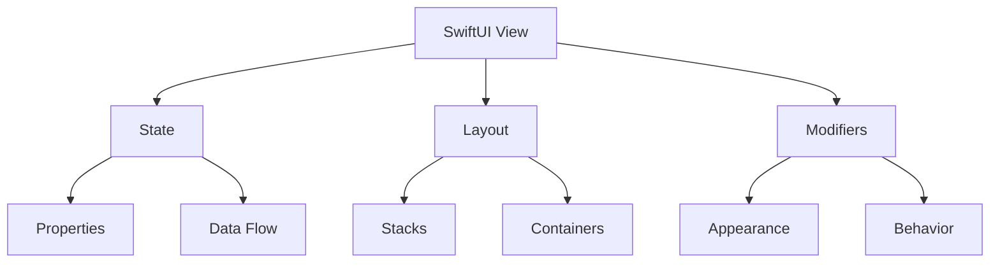
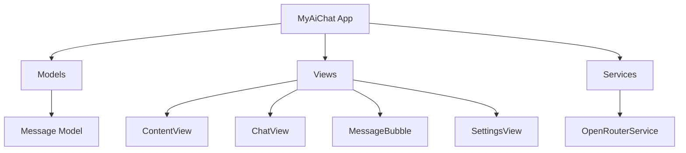
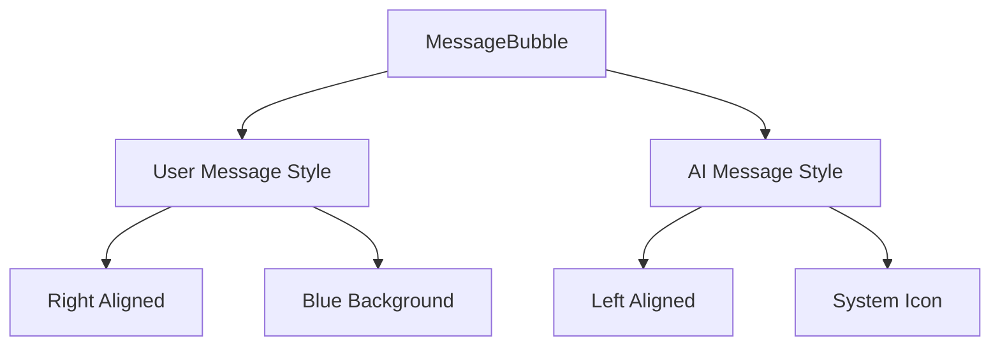
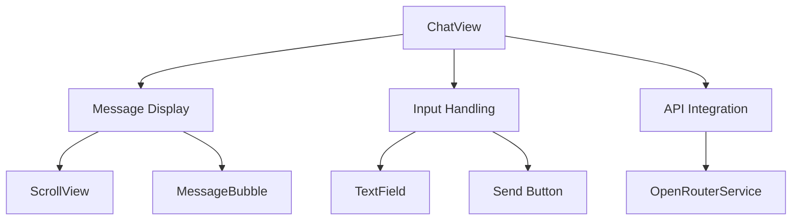
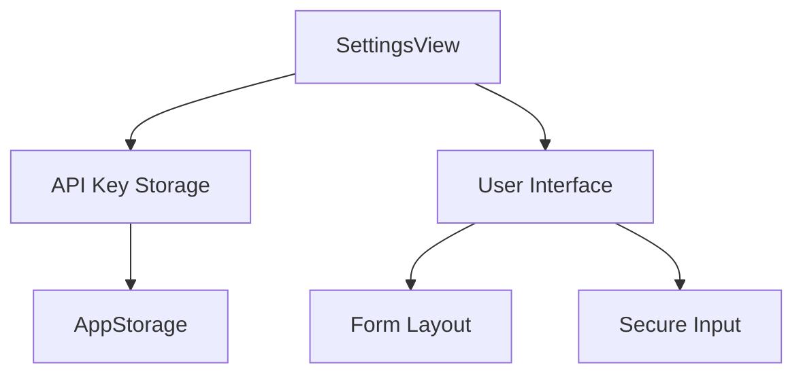
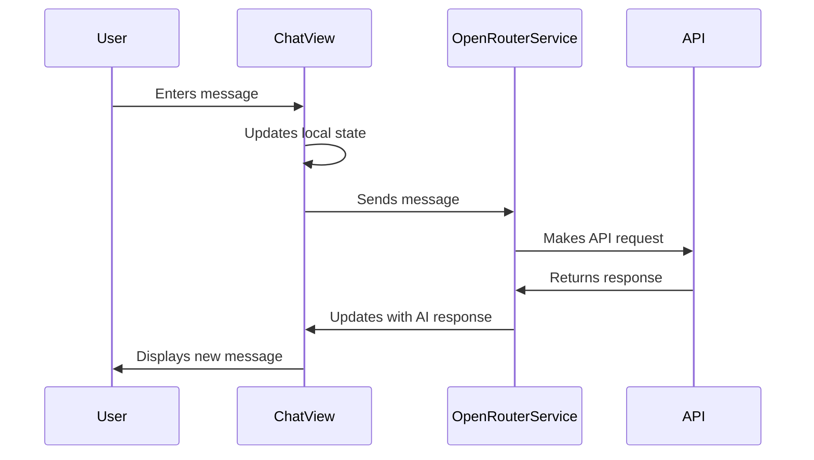

# Building an AI Chat Application: A Detailed Implementation Guide

## SwiftUI Fundamentals for Beginners

### Understanding SwiftUI Basics



#### 1. What is SwiftUI?
SwiftUI is a declarative framework, meaning you describe WHAT you want to create rather than HOW to create it. Think of it like writing a recipe:

```swift
// Instead of step-by-step instructions (imperative):
// 1. Create a text label
// 2. Set its color to blue
// 3. Make it bold
// 4. Add padding

// You declare what you want (declarative):
Text("Hello")
    .foregroundColor(.blue)
    .bold()
    .padding()
```

#### 2. Views and View Hierarchy
In SwiftUI, everything visible on screen is a View. Views can contain other views:

```swift
struct ExampleView: View {  // Your custom view
    var body: some View {   // Required property
        VStack {           // Container view
            Text("Hello")  // Child view
            Text("World")  // Child view
        }
    }
}
```

#### 3. State and Data Flow
SwiftUI uses property wrappers to manage data:

```swift
struct CounterView: View {
    // @State: For data that belongs to this view
    @State private var count = 0
    
    // @Binding: For data passed from parent view
    @Binding var isEnabled: Bool
    
    // @StateObject: For complex objects that persist
    @StateObject private var viewModel = ViewModel()
    
    var body: some View {
        VStack {
            Text("Count: \(count)")
            Button("Increment") {
                count += 1  // Automatically updates UI
            }
        }
    }
}
```

### Common SwiftUI Patterns

#### 1. Stack Views
SwiftUI provides three main stack types:

```swift
// Vertical Stack
VStack(spacing: 10) {
    Text("Item 1")
    Text("Item 2")
}

// Horizontal Stack
HStack {
    Image(systemName: "star")
    Text("Rating")
}

// Depth Stack (3D)
ZStack {
    Color.blue        // Background
    Text("Overlay")   // Foreground
}
```

#### 2. Lists and ScrollViews
For scrollable content:

```swift
// Simple list
List {
    Text("Item 1")
    Text("Item 2")
}

// Scrollable content
ScrollView {
    VStack {
        ForEach(items) { item in
            ItemView(item: item)
        }
    }
}
```

#### 3. User Input
SwiftUI provides various input controls:

```swift
struct InputExample: View {
    @State private var text = ""
    @State private var isOn = false
    
    var body: some View {
        Form {
            // Text input
            TextField("Enter text", text: $text)
            
            // Toggle switch
            Toggle("Enable feature", isOn: $isOn)
            
            // Button
            Button("Submit") {
                // Action here
            }
        }
    }
}
```

## Architecture Overview

The application follows a clean architecture pattern with clear separation of concerns:



## Core Components Breakdown

### 1. Message Model
The foundation of our chat application is the [`Message.swift`](MyAiChat/Models/Message.swift) model:

```swift
struct Message: Identifiable, Codable, Equatable {
    let id = UUID()
    let content: String
    let isFromUser: Bool
    let timestamp: Date
}
```

**Key Components Explained:**
- `Identifiable`: Provides unique identification for SwiftUI lists
- `Codable`: Enables JSON encoding/decoding
- `Equatable`: Allows message comparison
- Properties:
  - `id`: Unique identifier for each message
  - `content`: The actual message text
  - `isFromUser`: Differentiates between user and AI messages
  - `timestamp`: Records message creation time

### 2. MessageBubble View
[`MessageBubble.swift`](MyAiChat/Views/MessageBubble.swift) handles the visual presentation of each message:



**Key Features:**
1. Conditional Styling:
   ```swift
   if message.isFromUser {
       Spacer()
       messageContent
           .background(Color.blue)
   } else {
       VStack {
           systemIcon
           messageContent
       }
   }
   ```
   - User messages: Right-aligned with blue background
   - AI messages: Left-aligned with system icon

2. Message Content Layout:
   ```swift
   private var messageContent: some View {
       VStack(alignment: .leading) {
           Text(message.content)
           Text(message.timestamp, style: .time)
       }
   }
   ```
   - Vertical stack for content and timestamp
   - Consistent padding and styling

### 3. ChatView Implementation
[`ChatView.swift`](MyAiChat/Views/ChatView.swift) serves as the main interface:



**Key Components:**

1. State Management:
   ```swift
   @StateObject private var apiService = OpenRouterService()
   @State private var messages: [Message] = []
   @State private var inputText = ""
   @FocusState private var isFocused: Bool
   ```
   - `@StateObject`: Manages API service lifecycle
   - `@State`: Handles local UI state
   - `@FocusState`: Controls keyboard focus

2. Message Display:
   ```swift
   ScrollViewReader { proxy in
       ScrollView {
           LazyVStack(spacing: 8) {
               ForEach(messages) { message in
                   MessageBubble(message: message)
               }
           }
       }
   }
   ```
   - Efficient scrolling with `ScrollViewReader`
   - Lazy loading for performance
   - Automatic scrolling to new messages

3. Message Sending Logic:
   ```swift
   private func sendMessage() {
       // 1. Create user message
       let userMessage = Message(content: inputText, isFromUser: true)
       messages.append(userMessage)
       
       // 2. Clear input
       let messageText = inputText
       inputText = ""
       
       // 3. Send to API
       Task {
           do {
               let response = try await apiService.sendMessage(messageText)
               let aiMessage = Message(content: response, isFromUser: false)
               messages.append(aiMessage)
           } catch {
               // Handle error
           }
       }
   }
   ```
   - Synchronous UI updates
   - Asynchronous API communication
   - Error handling

### 4. Settings Management
[`SettingsView.swift`](MyAiChat/Views/SettingsView.swift) handles configuration:



**Key Features:**
1. Data Persistence:
   ```swift
   @AppStorage("openrouter_api_key") private var apiKey: String = ""
   ```
   - Uses `UserDefaults` for persistent storage
   - Secure API key handling

2. User Interface:
   ```swift
   Form {
       Section(header: Text("API Configuration")) {
           SecureField("OpenRouter API Key", text: $tempApiKey)
           Button("Save API Key") { /* ... */ }
       }
   }
   ```
   - Organized form layout
   - Secure input field
   - Immediate feedback on save

## State Management Flow



## Best Practices and Implementation Tips

1. **State Management**
   - Use `@State` for local view state
   - Use `@StateObject` for shared service instances
   - Use `@AppStorage` for persistent data

2. **Performance Optimization**
   - Implement lazy loading with `LazyVStack`
   - Use `ScrollViewReader` for smooth scrolling
   - Manage memory with proper view lifecycle

3. **Error Handling**
   - Implement comprehensive error handling
   - Provide user feedback for errors
   - Use async/await for clean asynchronous code

4. **UI/UX Considerations**
   - Implement responsive layouts
   - Handle keyboard interactions
   - Provide visual feedback for actions

## Testing Strategy

1. **Unit Tests**
   - Test Message model conformance
   - Verify API service methods
   - Check state management logic

2. **UI Tests**
   - Verify message display
   - Test user interactions
   - Validate navigation flow

3. **Integration Tests**
   - Test API integration
   - Verify data persistence
   - Check error scenarios

## Troubleshooting Guide

1. **Common Issues**
   - API key configuration
   - Network connectivity
   - State management bugs

2. **Solutions**
   - Verify API key in settings
   - Check network connection
   - Debug state updates

## Further Enhancements

1. **Feature Ideas**
   - Message persistence
   - Multiple conversations
   - Rich text support
   - Voice input/output

2. **Performance Improvements**
   - Message caching
   - Pagination
   - Background processing

This guide provides a comprehensive breakdown of the AI Chat application's implementation, focusing on clear explanations and best practices for each component.