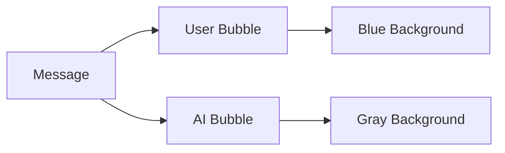

# Building an AI Chat App with SwiftUI
## Day 1: Foundation and Basic Chat Interface

---

# Welcome to Day 1! 👋
Today we'll build the foundation of our AI chat app

---

# Today's Goals 🎯

1. Set up our development environment
2. Create our data models
3. Build basic chat interface
4. Learn SwiftUI fundamentals

---

# Morning Session: Setup and Models

## Development Environment
- Create new Xcode project
- SwiftUI template
- iOS platform
- Name: "MyAiChat"

---

# Understanding Models 📝

## What are Models?
- Data structures that represent our app's information
- Blueprint for our data

```swift
// Simple example
struct Message {
    let content: String
    let isFromUser: Bool
    let timestamp: Date
}
```

---

# Our App's Model

## Message Model
- Content: What was said
- Who sent it (user or AI)
- When it was sent

---

# SwiftUI Basics 🔨

## Key Concepts:
- Views are functions of their state
- State management (@State)
- View composition
- Declarative syntax

---

# Afternoon Session: Chat Interface

## Components We'll Build:
1. Message Bubble
2. Chat View
3. Input Field
4. Send Button

---

# Message Bubble Design 💭

## Features:
- Different colors for user/AI
- Rounded corners
- Time stamp
- Dynamic sizing



---

# Building the Chat View 📱

## Key Features:
- Scrollable message list
- Text input field
- Send button
- Clean layout

---

# State Management Basics 🔄

## @State
- Source of truth
- Triggers view updates
- Simple value types

Example:
```swift
@State private var messages: [Message] = []
@State private var inputText = ""
```

---

# Today's Achievements 🌟

✅ Project setup complete
✅ Data models created
✅ Basic chat interface
✅ SwiftUI foundations

---

# Tomorrow's Preview 🔍

We'll add:
- AI Integration
- Settings View
- Message sending functionality

---

# Questions? 🤔

Let's review and clarify any concepts!