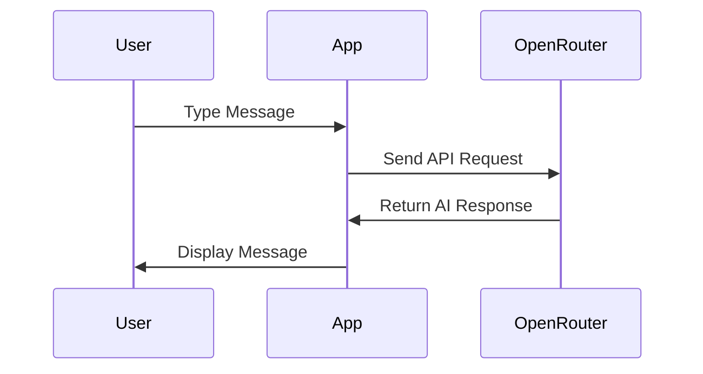

# Building an AI Chat App with SwiftUI
## Day 2: AI Integration and Settings

---

# Welcome Back! 👋
Today we'll make our chat app interactive with AI

---

# Today's Goals 🎯

1. Integrate OpenRouter AI service
2. Create settings interface
3. Add real-time chat functionality
4. Learn about API integration

---

# Morning Session: AI Integration

## OpenRouter Service Integration
- Understanding the provided service
- Setting up API key storage
- Implementing chat functionality
- Handling responses and errors

---

# Message Flow 📨



---

# ChatView Updates ✨

## New Features:
- API integration
- Loading indicators
- Error handling
- Real-time updates

## Code Focus Areas:
- @StateObject for API service
- @AppStorage for API key
- async/await usage
- MainActor updates

---

# Error Handling 🛠️

## What We'll Handle:
- Missing API key
- Network errors
- Invalid responses
- Loading states

## User Feedback:
- Error messages in chat
- Visual loading indicators
- Disabled controls when busy

---

# Afternoon Session: Settings

## SettingsView Features:
- API key management
- Secure storage
- Success feedback
- Basic app info

---

# Data Persistence 💾

## Using @AppStorage:
```swift
@AppStorage("openrouter_api_key") 
private var apiKey: String = ""
```

## Benefits:
- Automatic persistence
- SwiftUI integration
- Simple to implement
- Instant updates

---

# Testing Our Changes 🧪

## Test Cases:
- Send messages
- Check AI responses
- Verify error handling
- Confirm settings storage
- Test loading states

---

# Today's Achievements 🌟

✅ AI chat functionality
✅ Settings management
✅ Error handling
✅ Data persistence

---

# Tomorrow's Preview 🔍

We'll add:
- Chat history
- Tab navigation
- Final polish
- Complete testing

---

# Questions? 🤔

Let's review today's concepts!