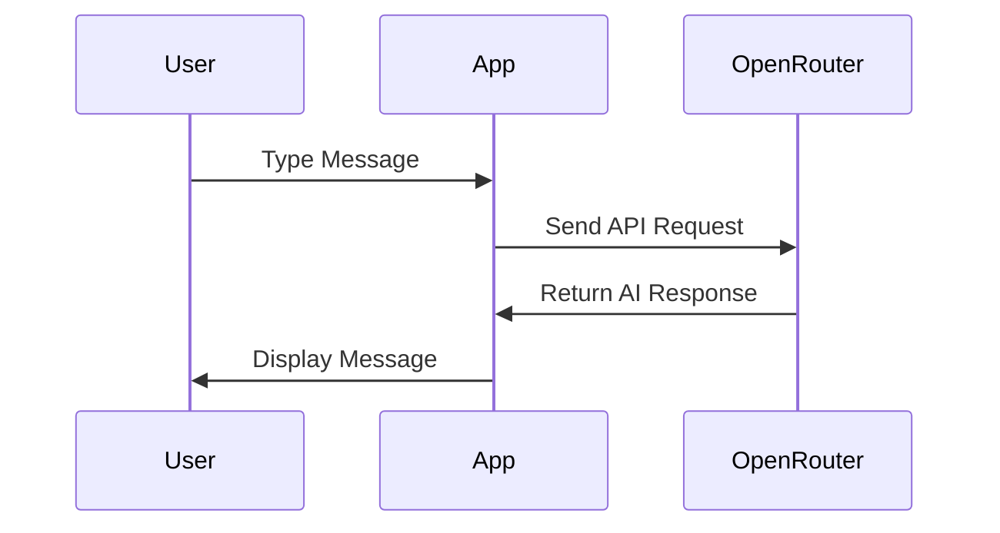

# Building an AI Chat App with SwiftUI
## Day 2: AI Integration and Settings

---

# Welcome Back! 👋
Today we'll make our chat app interactive with AI

---

# Today's Goals 🎯

1. Integrate OpenRouter AI service
2. Create settings interface
3. Add real-time chat functionality
4. Learn about API integration

---

# Morning Session: AI Integration

## New Properties We'll Add:
```swift
// Service to handle AI chat functionality
@StateObject private var apiService = OpenRouterService()

// Array to store all messages in the conversation
@State private var messages: [Message] = []

// Text entered by the user in the input field
@State private var inputText = ""

// Shows when we're waiting for AI response
@State private var isLoading = false

// Stores the API key persistently using UserDefaults
@AppStorage("openrouter_api_key") private var apiKey: String = ""
```

## What Each Property Does:
- `apiService`: Handles all communication with the AI
- `messages`: Stores our conversation history
- `inputText`: Manages the text input field
- `isLoading`: Shows a loading state while waiting
- `apiKey`: Saves the API key between app launches

---

# Message Flow 📨



---

# Building the Chat Interface 📱

## UI Components:
- Scrollable message list
- Text input field
- Send button with states:
  - Blue when ready to send
  - Gray when empty/loading
  - Disabled when can't send

```swift
// Message input area
HStack {
    // Text field for user input
    TextField("Type a message...", text: $inputText)
        .textFieldStyle(RoundedBorderTextFieldStyle())
    
    // Send button - changes color based on state
    Button(action: sendMessage) {
        Image(systemName: "paperplane.fill")
            .foregroundColor(inputText.isEmpty || isLoading ? .gray : .blue)
    }
    // Disable button when there's no text or while loading
    .disabled(inputText.isEmpty || isLoading)
}
```

---

# Handling Messages 🚀

## Send Message Function:
```swift
private func sendMessage() {
    // Check if we have text to send
    if inputText.isEmpty {
        return
    }
    
    // Create and show the user's message
    let userMessage = Message(content: inputText, isFromUser: true)
    messages.append(userMessage)
    
    // Store message text and clear input field
    let messageText = inputText
    inputText = ""
    
    // Show loading indicator while waiting for AI
    isLoading = true
    
    // Create a new background task to send message to AI
    Task {
        do {
            // Send message to AI and wait for response
            let response = try await apiService.sendMessage(messageText)
            
            // Create message from AI's response
            let aiMessage = Message(content: response, isFromUser: false)
            
            // Update the UI on the main thread
            await MainActor.run {
                messages.append(aiMessage)
                isLoading = false
            }
        } catch {
            // If there's an error, show it in the chat
            await MainActor.run {
                let errorMessage = Message(
                    content: "Error: \(error.localizedDescription)",
                    isFromUser: false
                )
                messages.append(errorMessage)
                isLoading = false
            }
        }
    }
}
```

## Error Handling:
- Shows error messages in chat
- Updates loading state
- Maintains UI responsiveness

---

# Afternoon Session: Settings

## SettingsView Features:
- API key management
- Secure storage
- Success feedback
- Basic app info

---

# Data Persistence 💾

## Using @AppStorage:
```swift
@AppStorage("openrouter_api_key") 
private var apiKey: String = ""
```

## Benefits:
- Automatic persistence
- SwiftUI integration
- Simple to implement
- Instant updates

---

# Testing Our Changes 🧪

## Test Cases:
- Send messages
- Check AI responses
- Verify error handling
- Confirm settings storage
- Test loading states

---

# Today's Achievements 🌟

✅ AI chat functionality
✅ Settings management
✅ Error handling
✅ Data persistence

---

# Tomorrow's Preview 🔍

We'll add:
- Tab navigation
- Final polish
- Complete testing

---

# Questions? 🤔

Let's review today's concepts!