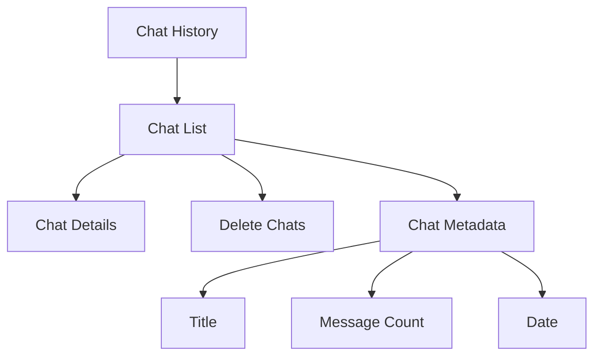

# Building an AI Chat App with SwiftUI
## Day 3: Polish and Final Features

---

# Welcome to Day 3! 👋
Today we'll complete our AI chat app

---

# Today's Goals 🎯

1. Implement chat history
2. Create tab navigation
3. Polish the interface
4. Final testing and debugging

---

# Morning Session: Chat History

## Features We'll Add:
- Save conversations
- View past chats
- Delete functionality
- Chat timestamps

---

# Local Storage with UserDefaults 💾

## Implementation:
```swift
// Saving chats
if let data = try? JSONEncoder().encode(chats) {
    UserDefaults.standard.set(data, forKey: "saved_chats")
}

// Loading chats
if let data = UserDefaults.standard.data(forKey: "saved_chats"),
   let savedChats = try? JSONDecoder().decode([Chat].self, from: data) {
    chats = savedChats
}
```

---

# Chat History View Structure 📚



---

# Tab Navigation 🗺️

## Main Structure:
- Chat tab for messaging
- History tab for past chats
- Settings tab for configuration

## Implementation:
- TabView with icons
- Smooth transitions
- Clear navigation

---

# Afternoon Session: Polish ✨

## UI Improvements:
- Consistent styling
- Smooth animations
- Loading indicators
- Error feedback
- Visual hierarchy

---

# Final Testing Checklist ✅

## Core Features:
- [ ] Message sending/receiving
- [ ] API key management
- [ ] Chat history saving/loading
- [ ] Chat deletion
- [ ] Tab navigation

## Error Scenarios:
- [ ] No API key
- [ ] Network issues
- [ ] Invalid responses
- [ ] Data loading errors

---

# Common Issues & Solutions 🛠️

## Watch Out For:
- API key persistence
- Loading state management
- Error message display
- Data saving timing

## Solutions:
- Verify settings storage
- Add loading indicators
- Implement error handling
- Test data persistence

---

# App Review 🔍

## What We've Built:
- Functional AI chat interface
- Settings management
- Chat history system
- Polish and feedback

---

# Key Learnings 📚

## Technical Skills:
- SwiftUI views and navigation
- API integration
- Data persistence
- Error handling
- State management

## Best Practices:
- User feedback
- Error handling
- Data management
- UI/UX design

---

# Congratulations! 🎉

You've built a complete AI chat app!

## Next Steps:
- Add more features
- Customize the UI
- Improve error handling
- Enhance chat history

---

# Questions? 🤔

Final review and discussion!