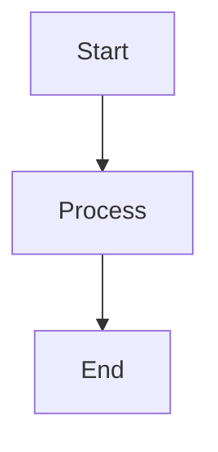

# Presentation Style Guide
## AI Chat App Coding Camp

This guide ensures consistency across all presentation materials and enhances readability.

## Slide Structure

### Title Slides
```markdown
# Main Title
## Subtitle

---
```

### Section Headers
```markdown
# Section Name 🔍
```

### Content Slides
- Use second-level headers (##) for main points
- Use bullet points for lists
- Include relevant emoji for visual cues

## Emoji Usage 

### Section Indicators
- 🎯 Goals and objectives
- 💻 Coding sections
- 🔨 Implementation
- 🛠️ Tools and setup
- 📝 Notes and explanations
- ✨ Features and updates
- 🧪 Testing
- ✅ Checklists
- 🌟 Achievements
- 🤔 Questions and discussion

### Technical Concepts
- 📦 Models and data structures
- 🔄 State management
- 💾 Data persistence
- 🌐 Networking
- 🎨 UI/UX elements
- 🗺️ Navigation
- 📱 Views and screens

## Code Block Formatting

### Swift Code
```markdown
```swift
// Code example
struct ExampleView: View {
    var body: some View {
        Text("Hello")
    }
}
```
```

### Important Code Highlights
Use `inline code` for:
- Property wrappers
- SwiftUI view names
- Swift keywords
- Variable names

## Diagrams

### Mermaid Diagrams
Use for:
- Flow charts
- Sequence diagrams
- Component relationships

Example:
```markdown

```

## Visual Hierarchy

### Lists
- Main points: bullet points (-)
- Sub-points: indented bullets
- Action items: checkboxes [ ]

### Emphasis
- **Bold** for key terms
- *Italic* for emphasis
- `Code` for technical terms

## Section Templates

### Goals Section
```markdown
# Today's Goals 🎯

1. First goal
2. Second goal
3. Third goal
```

### Implementation Section
```markdown
# Implementation 💻

## Key Components:
- Component 1
- Component 2

## Code Example:
```swift
// Code here
```
```

### Testing Section
```markdown
# Testing Checklist ✅

- [ ] Test item 1
- [ ] Test item 2
- [ ] Test item 3
```

## Progress Markers

### Start of Day
```markdown
# Welcome! 👋
Today we'll [description]
```

### End of Day
```markdown
# Congratulations! 🎉
- What we learned
- What's next
```

## Additional Guidelines

1. Keep slides focused and concise
2. Use consistent spacing between sections
3. Include code comments for clarity
4. Add visual breaks between major sections
5. End each section with review points
6. Include practical examples
7. Maintain proper indentation
8. Use descriptive section titles

## Colors and Styling
(When using a markdown presentation tool)

- Primary Color: #007AFF (iOS Blue)
- Secondary Color: #30B0C7 (Teal)
- Emphasis Color: #FF9500 (Orange)
- Success Color: #34C759 (Green)
- Warning Color: #FF3B30 (Red)

## Best Practices

1. Start each day with an overview
2. End each major section with a review
3. Include interactive elements
4. Use consistent terminology
5. Provide visual examples where possible
6. Include practical exercises
7. End with clear takeaways
8. Leave time for questions

This style guide ensures a consistent and professional look across all presentation materials while maintaining clarity and engagement for students.